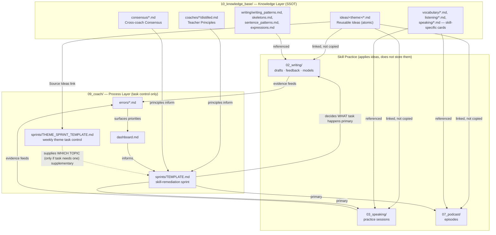

# Knowledge Architecture v2

> Last updated: 2026-07-06 (v2.3 — consolidated the knowledge layer into a single
> top-level folder, `10_knowledge_base/`. `ideas/`, `coaches/`, `consensus/`,
> `vocabulary/`, `listening/`, `speaking/`, `practice_method.md`, and `ARCHITECTURE.md`
> (previously scattered across a separate top-level `knowledge` folder) and
> `writing/` (previously a `knowledge` subfolder under `02_writing`) all now
> live as siblings under
> `10_knowledge_base/`, alongside the pre-existing `grammar/`, `prepositions/`,
> `word_form/` card sets. This was a pure relocation — no content changed.
>
> v2.2 (2026-07-05) — absorbed `vocabulary`, `listening`, `speaking` as new
> top-level knowledge categories; merged `writing`, `expressions`, `collocations`
> card sets into `writing/` and deleted the duplicates)

---

## Design Principles

### 1. Single Source of Truth (SSOT)

Every reusable IELTS idea lives in exactly one place: `10_knowledge_base/ideas/`. Writing,
Speaking, Podcast, and Sprint planning all **link** to an idea note — none of them
copy idea content into their own files. If the same argument shows up in two places,
that's a bug: one of them should be a link.

This same SSOT principle already applied to other knowledge types before this
architecture existed — Writing Patterns stay in `10_knowledge_base/writing/`, Coach
Principles stay in `10_knowledge_base/coaches/*/distilled.md`, Error Patterns stay in
`09_coach/errors/`. `10_knowledge_base/ideas/` applies the same rule to the one
knowledge type that used to leak into essay/model files instead of having its own
atomic, linkable home. All of these — `ideas/`, `writing/`, `coaches/`, `consensus/`,
`vocabulary/`, `listening/`, `speaking/` — are simply subfolders of the same
`10_knowledge_base/`, not separate SSOTs: one knowledge layer, one location.

### 2. Atomic Notes

One file = one reusable idea. Not one file per essay, not one file per theme with
five ideas crammed in. Atomicity is what makes an idea linkable, searchable, and
reusable independently of the essay it was first observed in.

An idea note must pass this test: **would this still be directly usable to write or
speak about a different topic in six months?** If not, it's essay-specific content,
not a reusable idea, and doesn't belong here.

### 3. Ideas as the only reusable-argument source

`10_knowledge_base/ideas/<theme>/` is the only place "reusable arguments/viewpoints" are
stored. Full essays, full spoken answers, and full podcast scripts are NOT reusable
ideas — they are applications of ideas, and they live in their own skill folders
(`02_writing/`, `03_speaking/`, `07_podcast/`).

### 4. Writing / Speaking / Podcast all reference Ideas

Each skill's draft/practice/episode template has a `Related Ideas` field that links to
`10_knowledge_base/ideas/<theme>/<idea>.md`. This is how the same idea gets reused across
three different skills without three different copies of it existing.

### 5. Theme Sprint only manages tasks — and is subordinate to Skill Sprint

`09_coach/sprints/THEME_SPRINT_TEMPLATE.md` schedules which theme is being practised
this week — it never stores idea content, only linking to `10_knowledge_base/ideas/<theme>/`.

It is explicitly **supplementary, not primary**: `09_coach/sprints/TEMPLATE.md`
(Skill Sprint) decides WHAT task happens each day (evidence-driven, D1→D3). Theme
Sprint only decides WHICH TOPIC to use when that task calls for one. It never adds,
replaces, or reschedules a Skill Sprint task — see `sprints/INDEX.md` and the
`start today` / `finish today` behaviour in `CLAUDE.md` for how the two connect.

### 6. Coach manages process, not knowledge

The AI Coach system (`09_coach/`) exists to track evidence, confidence, and task
sequencing — dashboard, sprints, error DBs, performance DBs. It is a process layer.
It does not hold reusable IELTS content itself; when it needs content (an idea, a
pattern, a coach principle), it reads from the knowledge layer.

### 7. Theme Sprint builds a Mental Model, not a model-essay collection

Reading Simon / Cambridge / official model essays / teacher material during a Theme
Sprint is not about memorising the text — it's about understanding how the writer
thinks: why the argument is organised that way, how a claim develops, which reasoning
pattern is being reused. A Theme Sprint's weekly output is always the abstracted
version (Core Arguments, a Claim→Reason→Mechanism→Impact→Example skeleton, Reasoning
Patterns, Functional Language, Natural Collocations) — never a saved copy of the
source essay itself. See `09_coach/sprints/THEME_SPRINT_TEMPLATE.md` § Guiding
Principle for the full rationale.

### 8. Knowledge Base tracks Learning Status, not just accumulation

The knowledge layer is not a write-only collection. Every idea note
(`10_knowledge_base/ideas/<theme>/*.md`) and every entry in `expressions.md` /
`writing_patterns.md` §8b carries a **Learning Status**: `New` → `Practised` →
`Internalised`. `New` means read and distilled but never used; `Practised` means used
at least once in real Writing or Speaking; `Internalised` means it comes out
naturally without conscious recall. The system should actively push entries from
`New` toward `Internalised` — not just keep adding more `New` entries. Status updates
happen during `finish today` / `批改`, whenever a knowledge item gets used in
practice. For the actual practice technique to move an item from `New` to
`Internalised`, see `10_knowledge_base/practice_method.md` (image/gesture/spoken-output
based — matches Connie's memory style, see `connie_profile.md` §10.1).

### 9. `10_knowledge_base/` also holds skill-specific reference cards, not just ideas/coaches

`vocabulary/`, `listening/`, and `speaking/` joined `ideas/`, `coaches/`, and
`consensus/` as top-level knowledge categories (2026-07-05). These came from this
same repo's original flat `grammar/` · `prepositions/` · `word_form/` · `vocabulary/`
· `listening/` · `speaking/` card system and were never duplicated elsewhere — they
were simply orphaned once Podcast generation stopped reading them for card rotation
(see `07_podcast/daily_template.md`). Organising them as their own subfolders keeps
one rule simple: **if it's reusable IELTS knowledge, not process/tracking, it lives
under `10_knowledge_base/`.** That folder also still holds `grammar/`, `prepositions/`,
`word_form/` — kept deliberately separate from `09_coach/errors/*.md` (teaching-card
format vs confidence-tracked error evidence).

### 10. One knowledge folder, not several

As of 2026-07-06, `10_knowledge_base/` is the single top-level knowledge folder —
`ideas/`, `coaches/`, `consensus/`, `vocabulary/`, `listening/`, `speaking/`,
`writing/`, `grammar/`, `prepositions/`, `word_form/`, `practice_method.md`, and this
file all live as siblings here. Earlier revisions of this document (v2.2 and
earlier) described a temporary state where the knowledge layer was split across a
separate top-level `knowledge` folder and a `knowledge` subfolder under
`02_writing`; that split has been reversed and neither of those paths exists
anymore.

---

## Knowledge Layer Map

---

## What lives where (quick reference)

| Content | Home | Notes |
|---|---|---|
| Reusable argument / viewpoint | `10_knowledge_base/ideas/<theme>/` | Atomic, one idea per file; each carries a `Skeleton` (Claim→Reason→Mechanism→Impact→Example) and a `Learning Status` |
| Essay structure / skeleton | `10_knowledge_base/writing/` | Not idea content — how to build an essay |
| Reasoning patterns (Cause→Mechanism→Result etc.) | `10_knowledge_base/writing/writing_patterns.md` §8b | Abstracted causal shapes, cross-topic |
| Reusable expressions / sentence patterns | `10_knowledge_base/writing/expressions.md` (function-based), `sentence_patterns.md` (position-based) | Language, not ideas — each entry carries a `Learning Status` |
| Coach's teaching principles | `10_knowledge_base/coaches/<coach>/distilled.md` | Not idea content — how the coach teaches |
| Cross-coach consensus | `10_knowledge_base/consensus/*.md` | Aggregated principles |
| Vocabulary sets (e.g. describing places/people) | `10_knowledge_base/vocabulary/*.md` | Organised as its own subfolder, 2026-07-05 — no longer duplicated anywhere, just reorganised |
| Listening strategies | `10_knowledge_base/listening/*.md` | Organised as its own subfolder, 2026-07-05 |
| Speaking strategies + Part 3 opinion openers | `10_knowledge_base/speaking/*.md` | Organised as its own subfolder, 2026-07-05, plus old `expressions/E004` merged in |
| Error patterns | `09_coach/errors/*.md` | Connie's own confirmed mistakes |
| Full essay drafts / feedback / models | `02_writing/task*/` | Applies ideas + patterns, doesn't define new reusable ones without going through 萃取知識 |
| Full speaking practice sessions | `03_speaking/practice/` | Applies ideas |
| Podcast episodes | `07_podcast/episodes/` | Applies ideas |
| Weekly theme task control | `09_coach/sprints/THEME_SPRINT_TEMPLATE.md` | Links only, stores nothing. **Supplementary** — supplies topic only |
| Skill-remediation sprint | `09_coach/sprints/TEMPLATE.md` | **Primary** — evidence-driven, 2-week, decides the actual task |
