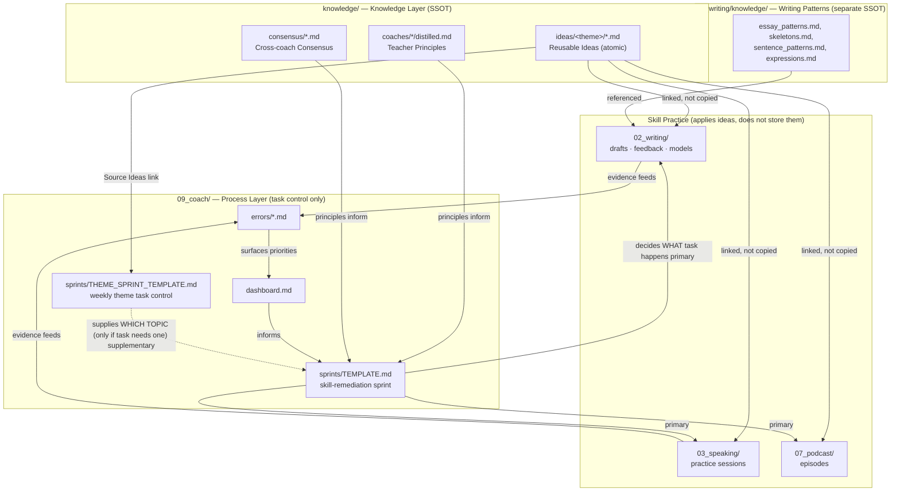

# Knowledge Architecture v2

> Last updated: 2026-07-04

---

## Design Principles

### 1. Single Source of Truth (SSOT)

Every reusable IELTS idea lives in exactly one place: `knowledge/ideas/`. Writing,
Speaking, Podcast, and Sprint planning all **link** to an idea note — none of them
copy idea content into their own files. If the same argument shows up in two places,
that's a bug: one of them should be a link.

This same SSOT principle already applied to other knowledge types before this
architecture existed — Writing Patterns stay in `02_writing/knowledge/`, Coach
Principles stay in `knowledge/coaches/*/distilled.md`, Error Patterns stay in
`09_coach/errors/`. `knowledge/ideas/` completes the set for the one knowledge type
that used to leak into `02_writing/knowledge/ideas.md` instead of having its own
top-level home.

### 2. Atomic Notes

One file = one reusable idea. Not one file per essay, not one file per theme with
five ideas crammed in. Atomicity is what makes an idea linkable, searchable, and
reusable independently of the essay it was first observed in.

An idea note must pass this test: **would this still be directly usable to write or
speak about a different topic in six months?** If not, it's essay-specific content,
not a reusable idea, and doesn't belong here.

### 3. Ideas as the only reusable-argument source

`knowledge/ideas/<theme>/` is the only place "reusable arguments/viewpoints" are
stored. Full essays, full spoken answers, and full podcast scripts are NOT reusable
ideas — they are applications of ideas, and they live in their own skill folders
(`02_writing/`, `03_speaking/`, `07_podcast/`).

### 4. Writing / Speaking / Podcast all reference Ideas

Each skill's draft/practice/episode template has a `Related Ideas` field that links to
`knowledge/ideas/<theme>/<idea>.md`. This is how the same idea gets reused across
three different skills without three different copies of it existing.

### 5. Theme Sprint only manages tasks — and is subordinate to Skill Sprint

`09_coach/sprints/THEME_SPRINT_TEMPLATE.md` schedules which theme is being practised
this week — it never stores idea content, only linking to `knowledge/ideas/<theme>/`.

It is explicitly **supplementary, not primary**: `09_coach/sprints/TEMPLATE.md`
(Skill Sprint) decides WHAT task happens each day (evidence-driven, D1→D3). Theme
Sprint only decides WHICH TOPIC to use when that task calls for one. It never adds,
replaces, or reschedules a Skill Sprint task — see `sprints/INDEX.md` and the
`start today` / `finish today` behaviour in `CLAUDE.md` for how the two connect.

### 6. Coach manages process, not knowledge

The AI Coach system (`09_coach/`) exists to track evidence, confidence, and task
sequencing — dashboard, sprints, error DBs, performance DBs. It is a process layer.
It does not hold reusable IELTS content itself; when it needs content (an idea, a
pattern, a coach principle), it reads from the knowledge layer.

---

## Knowledge Layer Map

---

## What lives where (quick reference)

| Content | Home | Notes |
|---|---|---|
| Reusable argument / viewpoint | `knowledge/ideas/<theme>/` | Atomic, one idea per file |
| Essay structure / skeleton | `02_writing/knowledge/` | Not idea content — how to build an essay |
| Reusable expressions / sentence patterns | `02_writing/knowledge/expressions.md`, `sentence_patterns.md` | Language, not ideas |
| Coach's teaching principles | `knowledge/coaches/<coach>/distilled.md` | Not idea content — how the coach teaches |
| Cross-coach consensus | `knowledge/consensus/*.md` | Aggregated principles |
| Error patterns | `09_coach/errors/*.md` | Connie's own confirmed mistakes |
| Full essay drafts / feedback / models | `02_writing/task*/` | Applies ideas + patterns, doesn't define new reusable ones without going through 萃取知識 |
| Full speaking practice sessions | `03_speaking/practice/` | Applies ideas |
| Podcast episodes | `07_podcast/episodes/` | Applies ideas |
| Weekly theme task control | `09_coach/sprints/THEME_SPRINT_TEMPLATE.md` | Links only, stores nothing. **Supplementary** — supplies topic only |
| Skill-remediation sprint | `09_coach/sprints/TEMPLATE.md` | **Primary** — evidence-driven, 2-week, decides the actual task |
